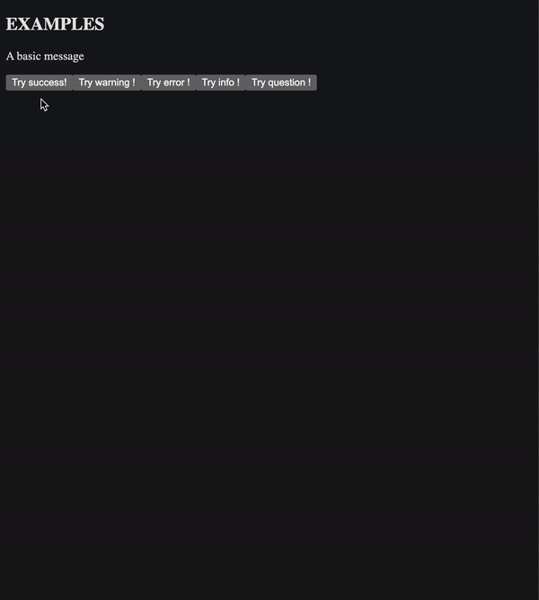

# SweetAlert for Leptos

[SweetAlert](https://sweetalert2.github.io/) is a JavaScript library for creating nice popups on the web.

My repo is a crate that allows you to use something similar in the [Leptos](https://leptos.dev) web framework.

> **NOTE**: This is not official. The SweetAlert team did not create this repo. I just wanted to be able to use SweetAlert in Leptos therefore I tried to re-create it myself. IT IS NOT EXACTLY THE SAME THING. I did not simply copy the CSS, I wrote it myself since my goal is not to have a perfect replica of SweetAlert, but to simplify the work for people that would like to have something similar. It is very easy to modify yourself, and if you want to customize it then feel free to simply copy the source files and the CSS files into your project.

## Disclaimer

This is not ready for production yet. The repo currently holds a [main.rs](./src/main.rs) and its only purpose is to help me test the CSS. When I'm done I will create a proper example and remove the unnecessary dependencies from [Cargo.toml](./Cargo.toml).

## How to use

First, you'd need to initialize the event handlers that allow the users to dismiss the Swal using the Escape key. It is also responsible for restricting the focus within the popup.

```rust
use leptos_sweetalert::*;

fn main() {
    Swal::init_key_handlers();
    // your leptos main function's body...
}
```

Then, use the `Swal` module and its `fire()` method to display a popup:

```rust
#[component]
fn App() -> impl IntoView {
    let confirm = move |_| {
        Swal::fire(SwalOptions {
            title: "This is a title",
            text: "This is some text",
            icon: SwalIcon::SUCCESS,
            confirm_button_text: "LETS GO",
            show_cancel_button: true,
            show_deny_button: true,
            ..SwalOptions::default()
        });
    };

    view! {
        <button on:click=confirm>Click to confirm</button>
    }
}
```

As you can see in the example above, the options you give to the `fire()` method is a struct named `SwalOptions`. As you probably already know, all the fields of a struct must be given a value when initialized. However, there is a lot of fields and it's quite inconvenient. Therefore, `SwalOptions` implements the [Default](https://doc.rust-lang.org/std/default/trait.Default.html) trait whose purpose is to give a default value to all fields. Use the `..` syntax to let Rust assign the default values to all fields that you don't specify. The default values are the same as those used by SweetAlert.

The example above displays a popup that looks like this:



> **NOTE**: there may have been some changes in the styles of the popup since this demo was first made.

For more info on how to use this crate, please see the examples and the Rust documentation on [crates.io](https://crates.io/).

## Generic types of SwalOptions

It's important to note that in order to make the use of the popup easier for the developer the `SwalOptions` struct is generic:

```rust
#[derive(Debug, Clone)]
pub struct SwalOptions<S = &'static str, I = SwalIcon>
where
    S: AsRef<str> + Clone + Copy + Default + leptos::IntoView,
    I: SwalIconLike + Default + Clone + Copy,
{
    // ...
}
```

Meaning that the Swal can be opened like this:

```rust
let some_title = String::from("This is a title");
Swal::fire(SwalOptions {
    // Choose between String or &str for the type of the text fields.
    // However you can't combine both in the same struct.
    title: some_title,
    icon: SwalIcon::SUCCESS,
});
```

In the example above both generic types are deduced (the string-like type, `S`, and `I` which is the type used for the icon). By default, the type of `S` is a `&'static str` and the type of `I` is `SwalIcon`. Unfortunately, in Rust it isn't possible to use a struct with default generic parameters without explicitly specifying one of them. As a consequence, if you're displaying a popup without an icon, then this syntax will be mandatory:

```rust
// Here "&str" is the type used for the text fields.
// Use whatever type suits you as long as it respects the constraints defined above.
Swal::fire(SwalOptions::<&str> {
    title: "Hello",
});
```

## Open multiple popups in a row

You can call a function when the user presses a button in the popup, and this function can very well open a new popup:

```rust
#[component]
fn App() -> impl IntoView {
    let confirm = move |_| {
        Swal::fire(SwalOptions {
            title: "This is a title",
            text: "This is some text",
            icon: SwalIcon::SUCCESS,
            // pre_confirm gets executed when the user clicks on the Confirm button.
            // It's prefixed with "pre" because it gets executed before the
            // popup closes, not after (see the 'then' field in the doc on crates.io).
            pre_confirm: || {
                Swal::fire(SwalOptions {
                    title: "Confirmed !",
                    ..SwalOptions::default()
                });
            },
            ..SwalOptions::default()
        });
    };

    view! {
        <button on:click=confirm>Click to confirm</button>
    }
}
```

You can close a popup programmatically via the `Swal::close()` method. Under the hood the `Swal::fire()` method closes the popup, waits for the closing animation to finish and then opens a new one with the given parameters. Therefore, if you're planning on opening a new popup whereas there is already one opened, then...

**don't do this:**

```rust
// This would unsync the animations,
// leading to weird behavior:
Swal::close(None);
Swal::fire(SwalOptions {
    title: "Hello",
    icon: SwalIcon::SUCCESS,
});
```

## What about asynchronous actions?

This crate does not support `async/await`, meaning that if you want to realize an asynchronous action via the popup, then you have to control the popup's lifetime on your own. Here is an example:

```rust
#[component]
fn App() -> impl IntoView {
    let confirm = move |_| {
        Swal::fire(SwalOptions {
            // By default, the Swal closes itself as soon as one of the buttons is pressed,
            // or if the user has either clicked on the backdrop or pressed the Escape key.
            // However, you can tell the popup to persist:
            auto_close: false,

            title: "This is a title",
            text: "This is some text",
            icon: SwalIcon::SUCCESS,
            confirm_button_text: "LETS GO",
            show_cancel_button: true,
            show_deny_button: true,
            pre_confirm: || {
                // Perform your asynchronous actions here...
                // ...
                //
                // Once you're done, you can manually close the popup.
                // You have to give a reason explaining why this popup is closing.
                // The result will then be passed to the `then` callback.
                // If you don't care about the result then just use `None`.
                //
                // Closing a popup without mentioning a result will not trigger the "then" callback.
                Swal::close(Some(SwalResult::confirmed()));
            },
            then: |result: SwalResult| {
                // this callback is called after `pre_confirm`,
                // only when the Swal is closing.
            },
            ..SwalOptions::default()
        });
    };

    view! {
        <button on:click=confirm>Click to confirm</button>
    }
}
```

To customize the behavior of the popup when performing asynchronous actions note that some useful methods exist to help you do that:

- `get_confirm_button()`
- `get_deny_button()`
- `get_cancel_button()`

## What about inputs?

SweetAlert allows you to use inputs directly in the popup. As of now, this feature is not supported the same way as SweetAlert does. To use inputs, you'd have to build the component on your own and insert it in the popup via the `body` field of `SwalOptions`. There is a good example that does further into details.

## What about Toasts?

SweetAlert comes with "toasts" which are small notifications appearing in a corner of the screen, usually for just a few seconds. This feature is not included in this crate and it will not get implemented. If you wish to use toasts, then there is already a great crate for this: [leptos_toaster](https://crates.io/crates/leptos_toaster).

## Create your own icons

You can create your own icons. There is already a full explanation in the documentation on [crates.io](https://crates.io/).

## Accessibility concerns

The popup follows the guidelines specified on [accede-web.com](https://www.accede-web.com/en/guidelines/rich-interface-components/modal-windows/).

To make sure the focus remains in the popup, all focusable elements within the popup must match this CSS query selector:

```
*:is(a[href], button, input, textarea, select, details):not([disabled]):not([aria-hidden=true]):not([inert]), [tabindex]:not([tabindex='-1'])
```

> Note that [inert](https://developer.mozilla.org/en-US/docs/Web/HTML/Global_attributes/inert) will not work as expected. If you want to make several elements inert, then apply the attribute to each of them, but not to a common parent.

> Note that elements with "display" set to "none" are also ignored.

## Contributing

I'm new to Leptos and more generally to Rust so if you wish to contribute then please do so.

## License

MIT License
